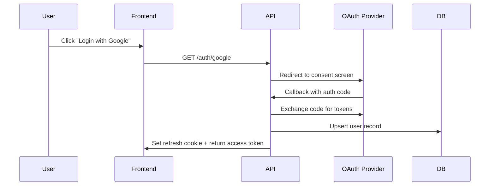
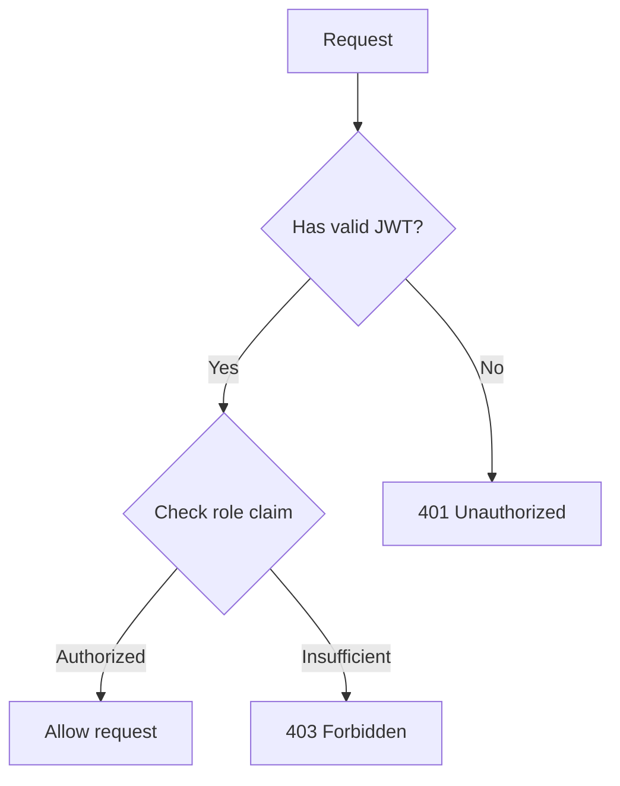

# User Authentication System

## Design Decisions

- Use short-lived access tokens (15 min) with rotating refresh tokens for security
- Store refresh tokens in an HTTP-only cookie, access tokens in memory
- Roles are embedded in the JWT claims to avoid DB lookups on every request

## System Architecture

## API Endpoints

- `GET /auth/google` — Initiate Google OAuth flow
- `GET /auth/github` — Initiate GitHub OAuth flow
- `GET /auth/callback` — Handle provider callback
- `POST /auth/refresh` — Refresh access token
- `POST /auth/logout` — Revoke session

## Data Model

- **users** table: id, email, name, avatar_url, provider, provider_id, role, created_at
- **sessions** table: id, user_id, refresh_token_hash, expires_at, created_at

## Security Considerations

- CSRF protection via SameSite cookies + double-submit pattern
- Rate limiting on auth endpoints (10 req/min per IP)
- Token rotation: each refresh invalidates the previous token
